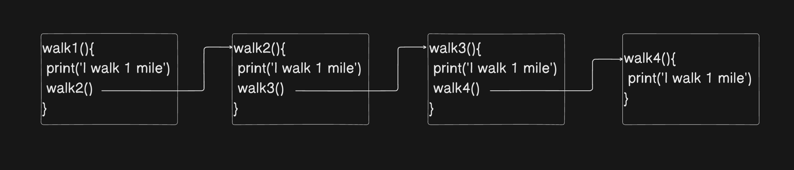
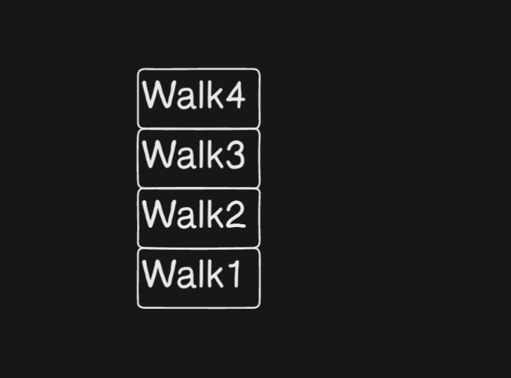
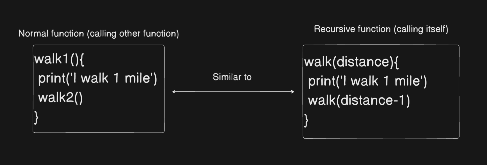
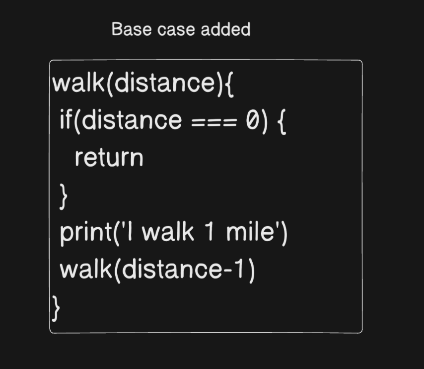
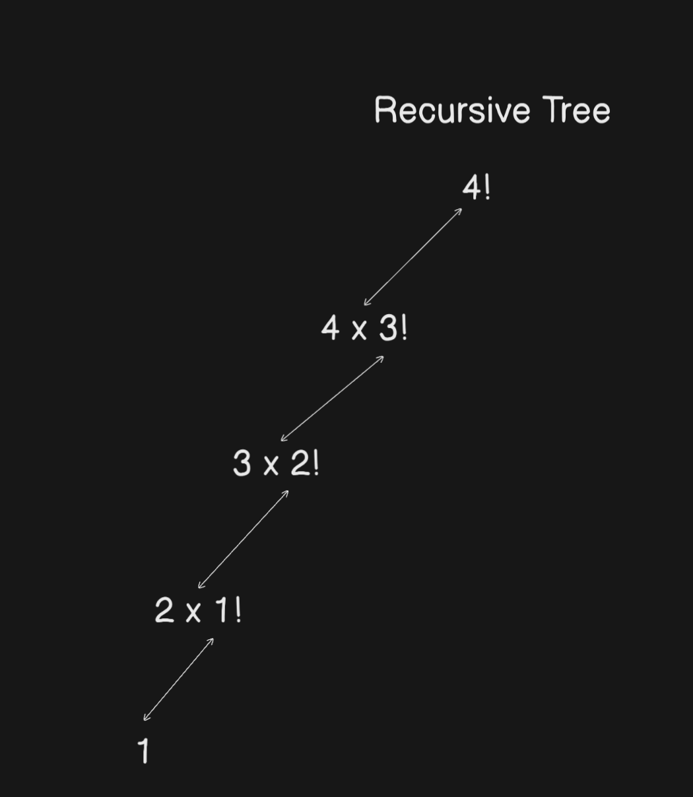

# What is Recursion

_This page introduces recursion with a factorial example, highlighting its definition, usage, and complexity._

<iframe 
  width="560" 
  height="315" 
  src="https://www.youtube.com/embed/8Q13bT1CAuQ?start=146" 
  frameborder="0" 
  allow="accelerometer; autoplay; clipboard-write; encrypted-media; gyroscope; picture-in-picture; fullscreen" 
  allowfullscreen>
</iframe>

## Explanation

### Definition of Recursion

**Recursion** is doing something **similar every time** with **different inputs** until a certain scenario (called the base condition) is reached.

In other words, it's about dividing a big problem into smaller subproblems (each subproblem is similar but with different inputs) and solving them one by one. The beauty is, it solves itself.

Consider this: you want to travel 4 miles. You could create 4 functions, where each function handles traveling 1 mile and then calls the next function.



**This function flow is easy because it is linear** (one after the other). If you observe, all the functions are similar. The last function doesn't call any other function because it represents the last mile we had left to walk (this is the base condition).

Here, we have divided our 4-mile walk into subproblems (4 functions in total), where each function (subproblem) handles walking 1 mile and then calls the next function. The stack trace looks like this:



By observing that each function (subproblem) is similar to the others and also has a base case (the last function where no further calls are made), we can combine all of them into one function with a base case. If the distance left is 0 miles, we simply return, and no further calls are made.





### Loops vs Recursion

A common question or confusion most students have is: when I can solve a problem using a loop, why should I use recursion?

Loops and recursion can often solve the same problems, but they approach them differently.

Some problems are more intuitive to solve using recursion due to their structure. If we can identify that a problem can be subdivided into smaller, similar subproblems, then recursion is a suitable approach.

Let's take an example of calculating factorial of a number.

#### Factorial of a number

The factorial of a number is the product of that number and all the positive integers less than it, down to 1.

```
4! = 4 x 3 x 2 x 1

3! = 3 x 2 x 1

2! = 2 x 1

1! = 1 (Base case)

0! = 1 (Base case)

```

We see that `4! = 4 x (3 x 2 x 1)` which is `4 x 3!`. This is the identification that helps us solve the problem recursively. The above can be written as,

```
4! = 4 x (3 x 2 x 1) = 4 x 3!

3! = 3 x (2 x 1) = 3 x 2!

2! = 2 x (1) = 2 x 1!

1! = 1 (Base case)

0! = 1 (Base case)
```

Writing recursive code for this looks like:

##### Factorial in a recursive way

```js
function factorialRecursive(n) {
  if (n === 0 || n === 1) {
    // Base case: factorial of 0 or 1 is 1
    return 1;
  }
  return n * factorialRecursive(n - 1); // Recursive call
}

const result = factorialRecursive(4);
console.log(result); // 24 -> 4 x 3 x 2 x 1
```



Let's write the factorial using loop:

##### Factorial in an iterative way

```js
function factorialIterative(n) {
  let result = 1; // Start with 1 since factorial multiplies numbers

  for (let i = n; i > 1; i--) {
    // Loop from n down to 2
    result *= i; // Multiply result by the current number
  }
  return result;
}

// The above loop can also be written as

function factorialIterative(n) {
  let result = 1; // Start with 1 since factorial multiplies numbers

  for (let i = 1; i <= n; i++) {
    // Loop from 1 to n (ascending order)
    result *= i; // Multiply result by the current number
  }
  return result;
}
```

---

### Time and Space complexity of Recursion

#### Time Complexity

The time complexity of a recursive function depends on **how many recursive calls are made** and the **operations performed in each call**.

For example, in the factorial function, each recursive call performs one multiplication, and the total number of recursive calls is n. Therefore, the time complexity is O(n).

#### Space Complexity

The space complexity of recursion can be viewed in two ways:

- **Auxiliary Space:** This is the extra space used by the algorithm, excluding the space required for recursion. It refers to any additional data structures or variables that the function might use.

For example, if a function creates an array or an object to store intermediate results, it contributes to auxiliary space. For an iterative solution, this would typically be O(1) if no extra space is used.

- **Call Stack Space:** In recursion, each function call adds an entry to the call stack. The call stack stores information about the function calls, such as parameters, local variables, and the return address. The depth of the recursion determines how many function calls are stored in the call stack. For a factorial function, the depth of recursion is n, so the space complexity due to the call stack is O(n).

**Example (Factorial Problem)**

For the factorial recursive function, the call stack depth increases with each recursive call:

```
For factorialRecursive(4):

Recursive calls: factorial(4), factorial(3), factorial(2), factorial(1)

Call stack depth = 4

Space complexity (call stack space) = O(n), where n is the depth of recursion.
```

In this case, there are no additional data structures used in the function, so the auxiliary space remains O(1). Therefore, the overall space complexity for recursion in this case is driven by the call stack space, which is O(n).
